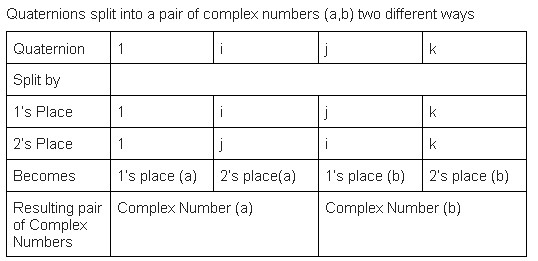
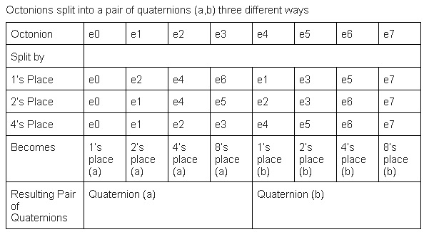
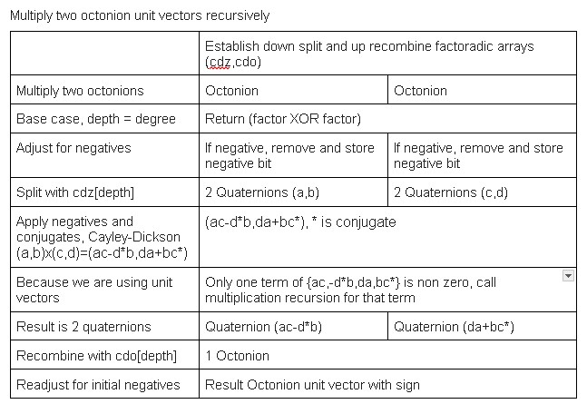
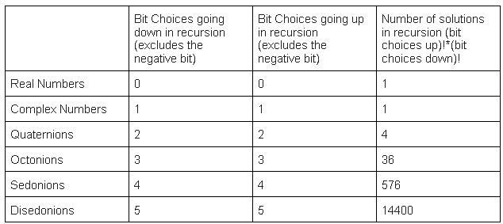

Hypercomplex unit vector chart\

These images are in the /src/Paper/ folder, and may help visualize the Cayley-Dickson algorithm

\
\
\
\

The Cayley-Dickson (CD) construction of hypercomplex numbers utilizes the equation $(a,b)x(c,d)=(ac-d*b,da+bc*)$ and that each degree hypercomplex is two of that below it, quaternions are two complex numbers, octonions are two quaternions, etc. This systematic variation of the process uses recursion to multiply two unit vectors, because generating whole sets of degree d multiplication tables has an $O(n)=d!*d!*2^(2d)$. When breaking down an octonion factor into a pair of quaternions, there is a choice of bit to group the factor, excluding the negative sign bit. You can group a quaternion by 1's place or by 2's place, you can group an octonion by 1's place, 2's place, or 4's place. If the 8 octonion unit vectors formed a cube, this bit selection is the same as selecting one of the six faces of that cube, then that face and its negative become the next two quaternions in recursion, and because it only deals with unit vectors, one of those two is going to be zero and can be discarded. The heart of the multiplication happens with quadrant, negative sign and conjugate adjustments using $(ac-d*b,da+bc*)$. When the recursion hits the base case 0 index layer, it multiplies them as reals, an XOR operation. Going up in recursion, it recombines them with a seperate factoradic. This recombination process is the deconstruction in reverse, selecting the d-dim face on which to put the result.\

The choices of bit going down in recursion and all choices of bit going up in recursion are two independent factoradics. An individual path down and an individual path back up are the bit selection list, in the source code named (cdz,cdo), with values ${0..degreeFactorial}$. These permuted Cayley-Dickson hypercomplex numbers can be any degree > 1, degree 1 is complex numbers and degree 1 is real, and multiplication tables of different bit choices table0=(cdz,cdo),table1=(cdzz,cdoo) interact independently as permutationCompositions(cdz,cdzz) and permutationCompositions(cdo,cdoo), the one's place and the unit power's place each producing the symmetric group d. Verifying this equation for degrees beyond sedonions becomes difficult as the $O(n)=d!*d!*d!*d!*2^2d$, so a stochastic checker is included, but it intuitively makes sense as permutations of the layers of the non-negative bits of the multiplication tables. 
The Fano plane code brute forces all possible numberings of the Fano plane and all possible associator bitmasks of valid numberings, resulting in 480 different octonion multiplication tables. A valid numbering of the Fano plane is 7 sets of integer triplets {1..7} that share no more than one element with any other set of triplets. An associator bitmask operates on the 7 elements of the Fano plane, adjusting the quadrant of the multiplication table it is operating in. A valid bitmask adjusts the negative signs of the 7 sets of 3 such that it is still equal to the original set of triplets. One or three changes in any triplet invalidates that bitmask, zero or two changes is allowed.

The permuted Cayley-Dickson octonions relate to Fano plane octonions as the lexicographically first set of triplets when the Cayley-Dickson numbers are equal, $cdz=cdo,cdzz=cdoo$. These two interactions are experimentally verified by Fano.fanoTest() and CayleyDickson.cdCompareAgainstPop(). The permuted CD octonion set of multiplication tables is a commonly used octonion using the initial triplet 1*2=4, when $cdz=cdzz,cdo=cdoo$, but loses some properties of octonions when $cdz!=cdzz$ or $cdo!=cdoo$. The negative signs stay the same but the unit vector bits of each individual element are permuted. The set of Fano triplets with index 10 in the code is the set that John Baez uses [@Baez].

@book{Wolfram,
Author = {Wolfram, Stephen},
Title = {A New Kind of Science},
Year = {2002},
Publisher = {Wolfram Media},
ISBN = {1579550088},
URL = {https://www.wolframscience.com},
Language = {English}
}

@paper{Baez,
author = {Baez, John},
title = {The Octonions},
publisher = {Bulleting of the American Mathematical Society},
number = {10.1090/S0273-0979-01-00934-X}
}