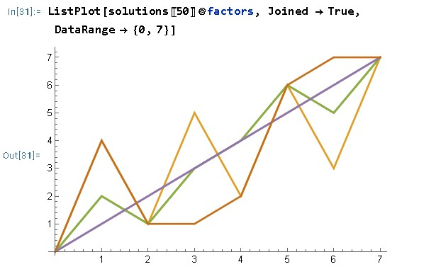

# Summary

Elementary cellular automata (ECA) are a set of simple binary programs in the form of truth tables called Wolfram codes that produce complex output when done repeatedly in parallel, and quaternions are frequently used to represent 3D space and its rotations in computer graphics. Both are well-studied subjects, this Java library puts them together in a new way. This project changes additive cellular automata into multiplicative automata [@Wolfram,p. 861] via permutations, hypercomplex numbers, and pointer arrays. Valid solutions extend the binary ECA to complex numbers, produce a vector field, make an algebraic polynomial, and generate some very interesting fractals. 

# Statement of Need

 The main algorithm produces several multiplicative versions of any given standard additive binary Wolfram code up to 32 bits and is written to support user supplied complex input at row 0 with choice of type of multiplication tables and partial product tables among other parameters. An algebraic polynomial of the automata that works with real and complex numbers is produced, and the hypercomplex 5-factor identity solution allows for the complex extension of any binary cellular automata. The GUI, though not required, allows for visual exploration of solutions with easy access to various parameters. The Java this is written in is designed to integrate well in other programs, such as Mathematica's JLink or Matlab, and is documented with Javadoc. The Cayley-Dickson and Fano construction libraries may be of value to the open source community as well. 

# Functions

Hypercomplex unit vector implementation\

The Cayley-Dickson (CD) and Fano support classes are discussed in greater detail in the readme and the documentation, they along with the Galois class provide sets of multiplication tables to be compared with cellular automata. The CD multiplication implementation permutes the steps of splitting and recombining hypercomplex numbers to increase the scope of the CD equation, $(a,b)x(c,d)=(ac-d*b,da+bc*)$, where * is the conjugate. It verifies itself by producing the symmetric group of its degree when interacting with other CD multiplications and producing permutations of layers of XOR operating on the non-negative place bits, while the negative sign bit layer stays the same. The Fano library octonions produce a triplet that is a linear match to the CD octonions, and John Baez's octonion triplets. [@Baez].\

The main algorithm uses a set of permutations operating on cellular automata input, each permuted neighborhood becoming a factor, with four kinds of multiplications. \

The first set of multiplications, column A, brute forces all possible sets of permutations on all possible binary neighborhoods of the Wolfram code. A permutation in the set rearranges the columns of the input neighborhood, these become a set of factors.  A valid set of permutations is one that, for all possible input neighborhoods, the set of constructed factors using the permuted neighborhoods always multiplies out to a value that points to an equal value within the Wolfram code. The set of multiplication results is a pointer array that reproduces the original Wolfram code for every possible binary neighborhood. Identity solutions of 5 factors using all zero permutations exist for Wolfram codes up to 32 bits, using hypercomplex numbers and Galois addition but not Galois multiplication. The factors constructed are a loose diagonal through the multidimensional multiplication table, starting at the origin and ending at the opposite corner while zig-zagging.

Permutations of 3 bit neighborhoods\

Flattened path through a six dimensional multiplication table\
Six factors, permutation set = {0,1,2,3,4,5}\
\

Multiplications B and C take a valid solution from the first set of multiplications, and apply them to complex input. Multiplication B is the Cartesian product of the permuted neighborhoods, using a partial product table to generate a polynomial. Multiplication C does the binary sum of complex neighborhood, then multiplies as complex. Both B and C take the n-th root of the result, with n = numColumns and n = numFactors, respectively. Multiplications B and C both include a binary weighted sum of the neighborhood, same as the construction of the factors from A, though B and C use complex. B, as part of the normalization and C as the construction. Multiplication C is the permutation composition product. B, just before the normalization is a neighborhood of multiplication results, with each column of it being a unit vector coefficient. This multiplication result neighborhood is permuted by the inverse of the permutation composition product to properly order the output vector.

 The call to the Wolfram code truth table is implemented with complex numbers by considering the sign values of the real and imaginary parts as binary numbers of two planes of separate cellular automata using the additive Wolfram code. Values less than zero are one, and values greater than one are zero, then the neighborhood's components are separately binary summed and plugged into the Wolfram code. If the Wolfram code is zero at each total's location, its part is zeroed out or made negative depending on parameters. The algorithm works with complex numbers, takes user input, and is tested via the GUI with random complex numbers at row 0.

\
\
\
\
\

# References