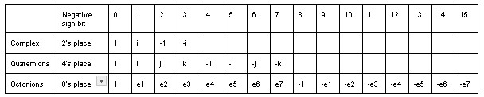
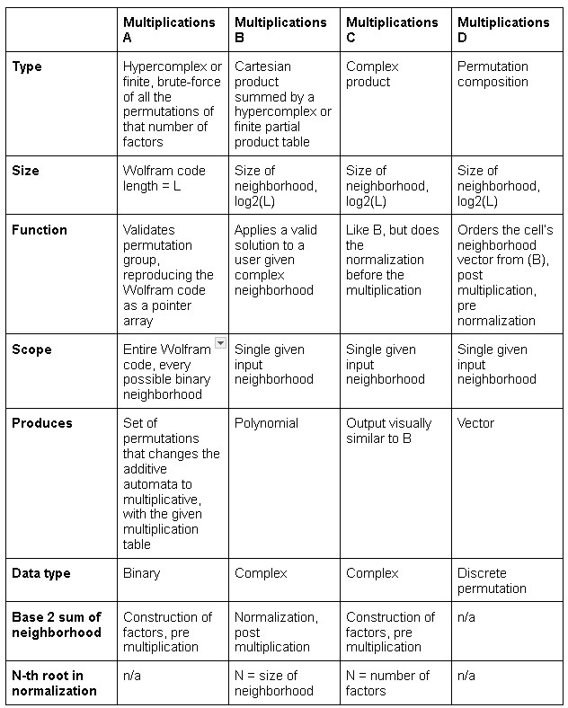
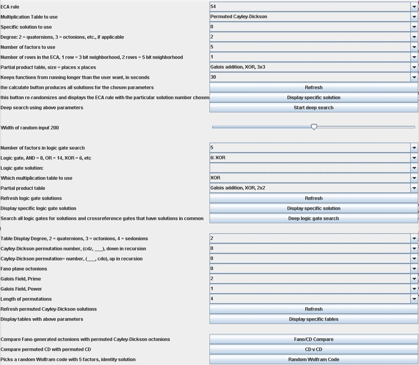
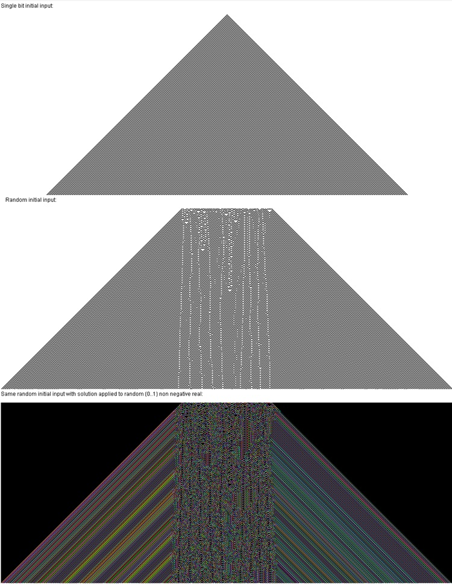

# Summary

Elementary cellular automata (ECA), octonions, permutation compositions, and Galois fields are well-studied subjects, this Java library puts them together in a new way. Standard additive ECA [@Wolfram] are tranformed into multiplicative automata [@Wolfram,page 861] via permutation groups, hypercomplex numbers, and pointer arrays. Valid solutions extend the binary ECA to complex numbers, produce a vector field, make an algebraic polynomial, and generate interesting fractals. 

# Statement of Need

 The main algorithm produces several multiplicative versions of any given standard additive binary Wolfram code up to 32 bits and is written to support user supplied complex input at row 0 with choice of type of multiplication tables and partial product tables among other parameters. An algebraic polynomial of the automata that works with complex numbers is produced, and the hypercomplex 5-factor identity solution allows for the complex extension of any binary cellular automata. The GUI, though not required, allows for visual exploration of solutions with easy acces to various parameters. The Java this is written in is designed to integrate well in other programs, such as Mathematica's JLink or Matlab and the Cayley-Dickson and Fano construction libraries may be valuable to the open source community as well. The project is extensively documented using Javadoc and there is an HTML indexed set of some images produced.

# Functions

This library mainly deals with hypercomplex unit vectors rather than whole quaternions or octonions.  The unit vectors correspond to the pattern in the table below. The negative sign bit is the highest place bit in a unit vector, and the code as a whole is consistently little-endian and zero indexed, including the Wolfram codes.

Hypercomplex unit vector chart\

The Cayley-Dickson (CD) and Fano support classes are discussed in greater detail in the readme and the documentation. The CD algorithm verifies itself by producing the symmetric group of its degree when interacting with other CD multiplications, and the Fano library octonions produce a linear match to the CD octonions. The Fano library also produces John Baez's octonions [@Baez].

Additional CD material added from readme:

\
\
\
\

The Cayley-Dickson (CD) construction of hypercomplex numbers utilizes the equation $(a,b)x(c,d)=(ac-d*b,da+bc*)$ and that each degree hypercomplex is two of that below it, quaternions are two complex numbers, octonions are two quaternions, etc. This systematic variation of the process uses recursion to multiply two unit vectors, because generating whole sets of degree d multiplication tables has an $O(n)=d!*d!*2^(2d)$. When breaking down an octonion factor into a pair of quaternions, there is a choice of bit to group the factor, excluding the negative sign bit. You can group a quaternion by 1's place or by 2's place, you can group an octonion by 1's place, 2's place, or 4's place. If the 8 octonion unit vectors formed a cube, this bit selection is the same as selecting one of the six faces of that cube, then that face and its negative become the next two quaternions in recursion, and because it only deals with unit vectors, one of those two is going to be zero and can be discarded. The heart of the multiplication happens with quadrant, negative sign and conjugate adjustments using $(ac-d*b,da+bc*)$. When the recursion hits the base case 0 index layer, it multiplies them as reals, an XOR operation. Going up in recursion, it recombines them with a seperate factoradic. This recombination process is the deconstruction in reverse, selecting the d-dim face on which to put the result.\

The choices of bit going down in recursion and all choices of bit going up in recursion are two independent factoradics. An individual path down and an individual path back up are the bit selection list, in the source code named (cdz,cdo), with values ${0..degreeFactorial}$. These permuted Cayley-Dickson hypercomplex numbers can be any degree > 1, and multiplication tables of different bit choices table0=(cdz,cdo),table1=(cdzz,cdoo) interact independently as permutationCompositions(cdz,cdzz) and permutationCompositions(cdo,cdoo), the one's place and the unit power's place each producing the symmetric group d. Verifying this equation for degrees beyond sedonions becomes difficult as the $O(n)=d!*d!*d!*d!*2^2d$, so a stochastic checker is included.

The Fano plane code brute forces all possible numberings of the Fano plane and all possible associator bitmasks of valid numberings, resulting in 480 different octonion multiplication tables. A valid numbering of the Fano plane is 7 sets of integer triplets {1..7} that share no more than one element with any other set of triplets. An associator bitmask operates on the 7 elements of the Fano plane, adjusting the quadrant of the multiplication table it is operating in. A valid bitmask adjusts the negative signs of the 7 sets of 3 such that it is still equal to the original set of triplets.

The permuted Cayley-Dickson octonions relate to Fano plane octonions as the lexicographically first set of triplets when the Cayley-Dickson numbers are equal, $cdz=cdo,cdzz=cdoo$. These two interactions are experimentally verified by Fano.fanoTest() and CayleyDickson.cdCompareAgainstPop(). The permuted CD octonion set of multiplication tables is a commonly used octonion using the initial triplet 1*2=4, when $cdz=cdzz,cdo=cdoo$, but loses some properties of octonions when $cdz!=cdzz$ or $cdo!=cdoo$. The negative signs stay the same but the unit vector bits of each individual element are permuted. The set of Fano triplets with index 10 in the code is the set that John Baez uses [@Baez].

The main algorithm uses permutation groups and four kinds of multiplication using valid permutation group. 

The main algorithm uses a set of permutations operating on the neighborhood of the cellular automata, with four kinds of multiplications. The first set of multiplications, A, brute forces all possible sets of permutations. A permutation in the set rearranges the columns of the input neighborhood, these become a set of templates applied to every possible binary input neighborhood for that Wolfram code and becomes a hypercomplex unit vector via the binary sum of the permuted neighborhood and the chart above, becoming a set of factors.  A valid set of permutations is one that, for all possible input neighborhoods, the set of constructed factors using the permuted neighborhoods always multiplies out to a value that points to an equal value within the Wolfram code, the set of multiplication results is a pointer array that reproduces the original Wolfram code. Identity solutions of 5 factors using all zero permutations exist for Wolfram codes up to 32 bits, using hypercomplex numbers and Galois addition but not Galois multiplication. The set of factors constructed for a valid permutation group are a twisted diagonal, starting at the origin and ending at the opposite corner.

The second and third multiplications take a valid solution from the first set of multiplications, and apply them to complex input. The second multiplication is the Cartesian product of the permuted neighborhoods, using a partial product table to generate a polynomial. The third multiplication does the binary sum of complex neighborhood, then multiplies as complex. Both the second and third multiplications take the n-th root of the result, with n = numColumns and n = numFactors, respectively. Multiplications B and C both include a binary sum of the neighborhood parallel to the construction of the binary factors from the first part, the second as part of the normalization and the third as part of the construction.  There are several normalization parameters from there. The last multiplication is a standard permutation composition product of a valid permutation group. The second multiplication just before the normalization is a vector, with each column of the multiplication result being a unit vector coefficient. This multiplication result neighborhood is permuted by the inverse of the permutation composition product to properly order the vector.

The algorithm works with complex numbers and is tested via the GUI with random complex numbers. The cellular automata function is implemented with complex numbers by considering the sign values of the real and imaginary parts as binary numbers of two planes of seperate cellular automata using the additive Wolfram code. Values less than zero are one, and values greater than one are zero, then the neighborhood's components are seperately binary summed and plugged into the Wolfram code. If the Wolfram code is zero at each total's location, its part is zeroed out. 

Control Panel\
\
Fifty Four\
\
Fifty Four\
\
Fifty Four\
\
Solution's diagonal through the numFactors-dim multiplication table, loaded with Mathematica's JLink\
\

# References

[@Wolfram]
[@Baez]
