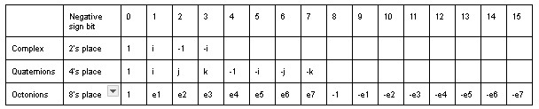
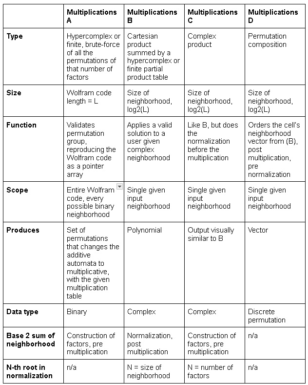
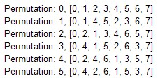
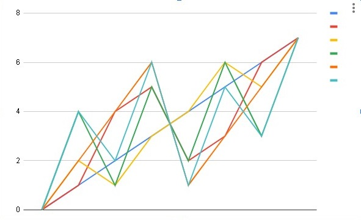
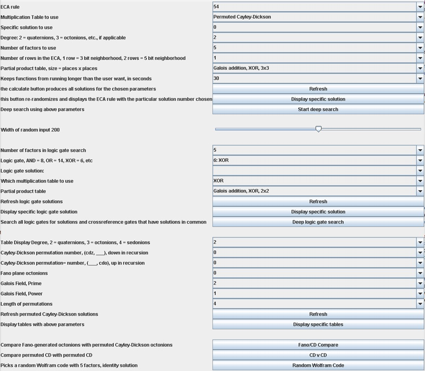
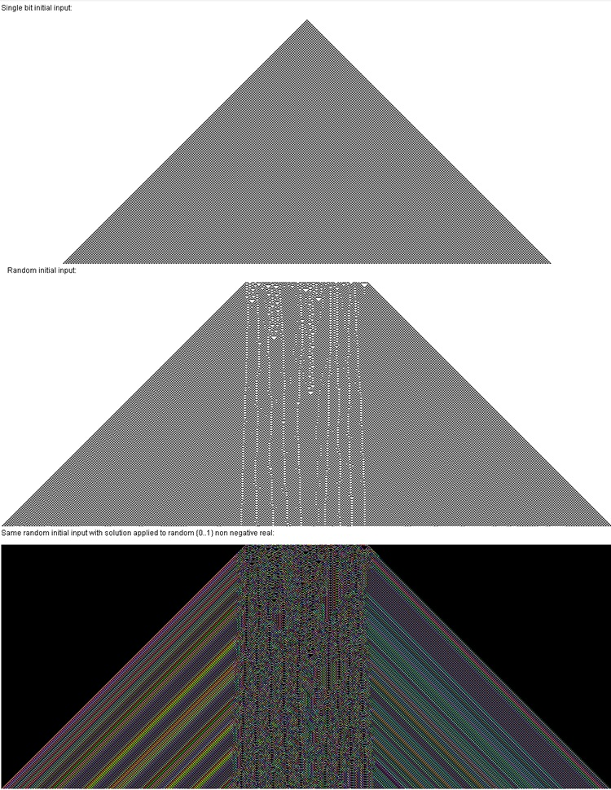
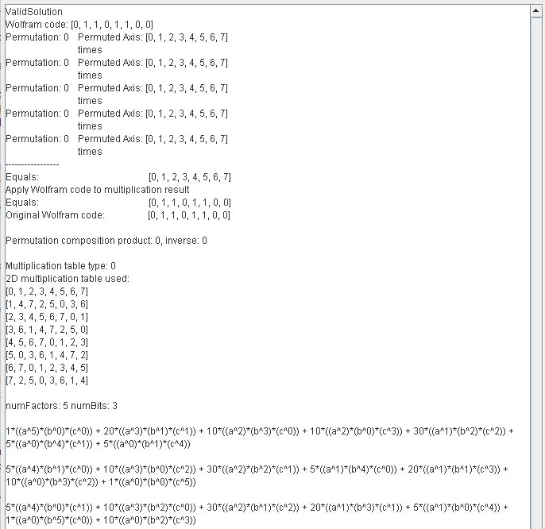
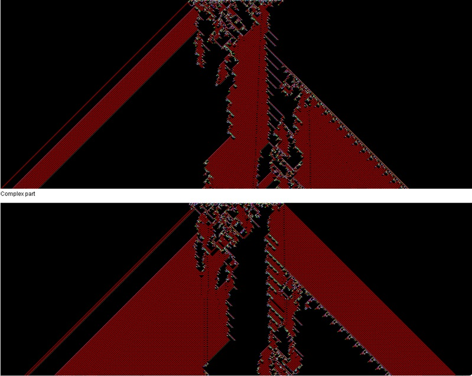

# Summary

Elementary cellular automata (ECA) are a set of simple binary programs in the form of truth tables called Wolfram codes that produce complex output when done repeatedly in parallel, and quaternions are frequently used to represent 3D space and its rotations in computer graphics. Both are well-studied subjects, this Java library puts them together in a new way. This project changes classical additive cellular automata into multiplicative automata [@Wolfram,p. 861] via permutations, hypercomplex numbers, and pointer arrays. Valid solutions extend the binary ECA to complex numbers, produce a vector field, make an algebraic polynomial, and generate some very interesting fractals. 

The code repository is at https://github.com/dmcki23/MultiplicativeECA. 

# Statement of Need

 Very loosely analogous to De Morgan's law in Boolean algebra, the main algorithm produces several multiplicative versions of any given standard additive binary Wolfram code up to 32 bits and is written to support user supplied complex 1-D input at row 0 with choice of type of multiplication tables and partial product tables among other parameters. It produces an algebraic polynomial and complex vector field output for any given Wolfram code, and the hypercomplex 5-factor identity solution allows for the complex extension of any binary cellular automata.  The Cayley-Dickson and Fano construction libraries may be of value to the open source community as well. 

There are other cellular automata implementations, Mathematica [@Mathematica], CellPyLib [@Antunes2021], a JOSS Python project from three years ago, and others. This is not designed to replace those awesome general purpose utilities, it's focused on the new Wolfram code operation. The GUI is designed to show enough to conclude that the math works and give a rough idea of aggregate behavior over parameters and the algorithm code is designed to be able to split off and be plugged in somewhere else. There are useful things you can build on it directly or indirectly, like making Bloch spheres out layers of complex number output and translating complex Wolfram code output to quantum logic, Fourier analysis, 2D automata, a complex version of the prime number automata [@Wolfram,p. 640], Gray code and full group theory morphisms of multiplication tables and paths, and making N-D ellipses out of the paths through the multiplication tables, that are clear directions to go in but subject to a different set of decisions like application-specific tech debt and potential translation to C++ or Python and out of scope of this paper. 

# Functions

Hypercomplex unit vector implementation\

The Cayley-Dickson (CD) and Fano support classes are discussed in greater detail in the readme and the documentation, they along with the Galois class provide sets of multiplication tables to be compared with cellular automata. The CD multiplication implementation permutes the steps of splitting and recombining hypercomplex numbers to increase the scope of the CD equation, $(a,b)x(c,d)=(ac-d*b,da+bc*)$, where * is the conjugate. It verifies itself by producing the symmetric group of its degree when interacting with other CD multiplications. The Fano library octonions produce a triplet that is a linear match to the CD octonions as triplets{0} when the up and down recursion factoradics are equal, and produce the triplet set of John Baez's Fano plane as triplets{10}. [@Baez].\

The main algorithm uses a set of permutations operating on cellular automata input, each permutation permuting the neighborhood, becoming a factor, with four kinds of multiplications. The multiplication tables are input as 2D but used as N-D, where N=numFactors.\
\

Multiplications A, additive to multiplicative\
r = specific Wolfram code\
n = binary neighborhood = 1*columnZero + 2*columnOne+ 4*columnTwo...2^(column)*columnCol, points to its value in r\
h = hypercomplex unit vector from binary\
H = inverse of h, binary value from hypercomplex unit vector\
p = a permutation of the neighborhood\
using hypercomplex multiplication, a valid permutation set produces:\
WolframCode(r, n) = WolframCode(r,  H(h(p(n)) * h(p(n)) * h(p(n)) ... numFactors), though n may or may not equal H(...)\
WolframCode(r, H(h(p(n)) * h(p(n)) * h(p(n)) ... numFactors)) is a pointer array that always points to an equal value (0,1) within WolframCode(r, _)\
each h(p(n)) in a valid solution is a factor template in the multiplication table for all values of its axis

The first set of multiplications, column A, brute forces all possible sets of permutations on all possible binary neighborhoods of the Wolfram code. A permutation in the set rearranges the columns of the input neighborhood, these become a set of factors.  A valid set of permutations is one that, for all possible input neighborhoods, the set of constructed factors using the permuted neighborhoods always multiplies out to a value that points to an equal value within the Wolfram code. The set of multiplication results is a pointer array that reproduces the original Wolfram code for every possible binary neighborhood. 

Identity solutions of 5 factors using all zero permutations exist for Wolfram codes up to 32 bits in this library using hypercomplex numbers and Galois addition. Galois multiplication takes a mix of numbers of factors to get the identity multiplication result array, there is a function in the GaloisField class that provides it. The factors constructed are a loose diagonal through the multidimensional multiplication table, starting at the origin and ending at the opposite corner while zig-zagging. The path lengths of each factor and the result are included in ValidSolution results.

Permutations of 3 bit neighborhoods\

Flattened path through a six dimensional multiplication table\
Six factors, permutation set = {0,1,2,3,4,5}\
\

Multiplications B and C apply a valid solution from the first set of multiplications to any given individual neighborhood with binary, non-negative real, and complex values. Multiplication B is the Cartesian product of the permuted neighborhoods, using a closed partial product table to generate a polynomial. Multiplication C does the binary sum of complex neighborhood, then multiplies as complex. Both B and C take the n-th root of the result, with n = numColumns and n = numFactors, respectively. Multiplications B and C both include a binary weighted sum of the neighborhood, same as the construction of the factors from A, though B and C use complex. B, as part of the normalization and C as the construction. Multiplication C is the permutation composition product. B, just before the normalization is a neighborhood of multiplication results, with each column of it being a unit vector coefficient. This multiplication result neighborhood is permuted by the inverse of the permutation composition product to properly order the output vector. There are a couple of normalization parameters and a hybrid multiplicative-additive output option that are discussed more in the documentation.

Control Panel\
\

ECA 54, binary and non negative real\
\

ECA 54, solution parameters, including polynomial\
\

ECA 54, solution output, complex\
\

# References